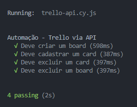

# DESAFIO QA SERASA 2025

[
](https://www.cypress.io/)
[
](https://nodejs.org/)
[
](https://www.npmjs.com/)
[](https://www.npmjs.com/package/mochawesome)  


## ☕ Objetivo do Projeto

Este projeto está relacionado à **DESAFIO QA SERASA 2025**

## 🚀 Instalação

Antes de começar, certifique-se de ter os seguintes requisitos mínimos instalados em seu ambiente de desenvolvimento:

- [Node.js](https://nodejs.org) (última versão)
- [Npm](https://www.npmjs.com) (gerenciadores de pacotes)


## 💻 Executando o Projeto

Para executar o projeto, siga os passos abaixo:

1. Certifique-se de que todas as dependências estão instaladas executando:
``npm install``

## 📝 Uso Instruções de Uso
1. Para usar o projeto por feature ou ambiente, siga os passos abaixo:
 ```bash 
 # Cypress Test Headless
 npm run cypress:run
 # Cypress Test Runner
 npm run cypress:open
``` 


## 📫 Contribuir Para contribuir com o projeto, siga estas etapas: 

1. Clone o projeto 
2. Crie um novo branch (`git checkout -b feature/newFeature`). 
3. Faça commit das suas alterações (`git commit -m 'feat: newFeature'`). 
4. Envie para o branch (`git push origin feature/newFeature`). 
5. Abra um Pull Request para o main. Alternativamente, veja a documentação do GitHub em [como criar um pull request](https://help.github.com/en/github/collaborating-with-issues-and-pull-requests/creating-a-pull-request). 


## 🤝 Contato Informações
Gabriel Figueiredo<br>
Email: gabrielgsfigueiredo@gmail.com<br>
GitHub: gabrielfign